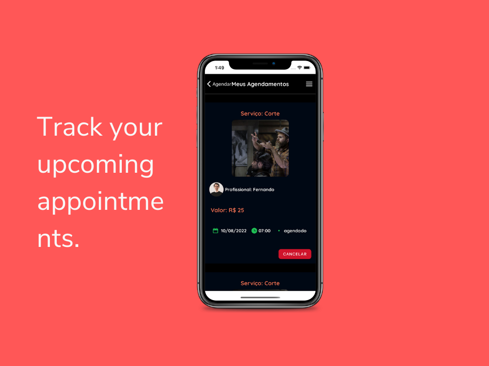
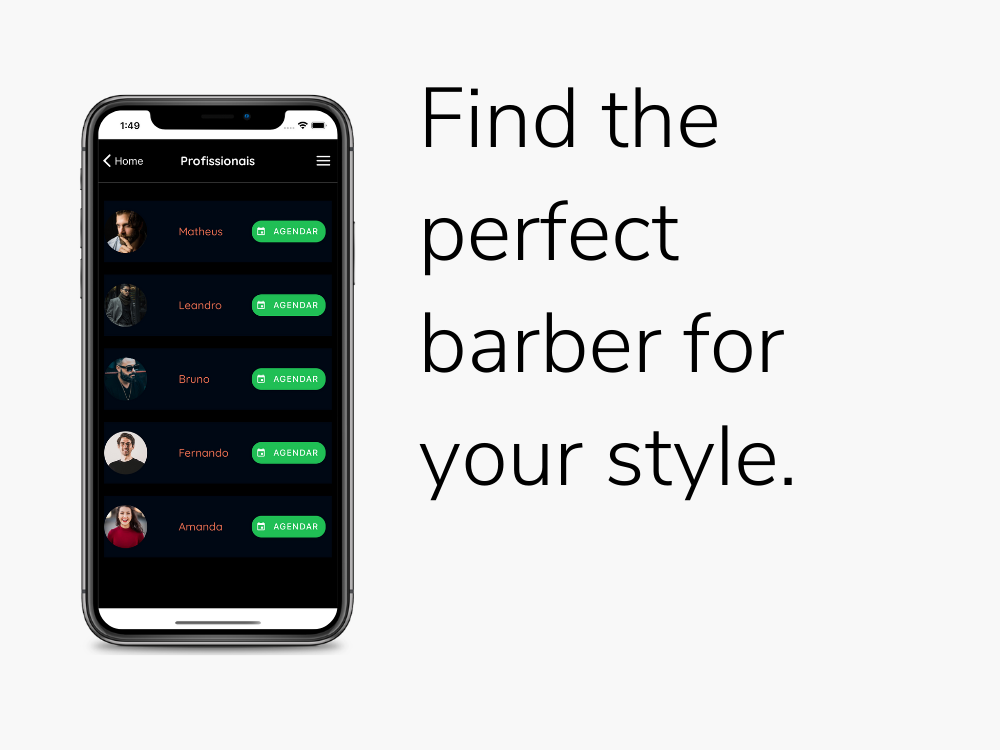

# Barber Master App

## Table of Contents
- [Installation](#installation)
- [Usage](#usage)
- [Contributing](#contributing)

## Barber Master

Barber Master is an App that allows users book appointment with barbers. This is app was created with React Native for the Front End Mobile and Node + MongoDB for the Backend.

The project also a dashboard panel, made in React.js for admins, to manage booked services.

## Installation {#installation}

To install Barber Master, follow these steps:

#### npm

1. Clone the repository onto your local machine
2. Run `npm install` to install the necessary dependencies
3. Run `npx expo start` to start the app

#### yarn

1. Clone the repository onto your local machine
2. Run `yarn install` to install the necessary dependencies
3. Run `npx expo start` to start the app
4. Run Backend code [here](here)

## Usage {#usage}

Once you've installed Barber Master, you can use it to:

- Book appointments with barbers
- Choose your preffered barber
- View your upcoming appointments
- Cancel appointments if necessary

## Contributing {#contributing}

If you'd like to contribute to Barber Master, please follow these steps:

1. Fork the repository
2. Create a new branch (`git checkout -b new-feature`)
3. Make your changes and commit them (`git commit -am 'Add new feature'`)
4. Push to the branch (`git push origin new-feature`)
5. Create a new Pull Request